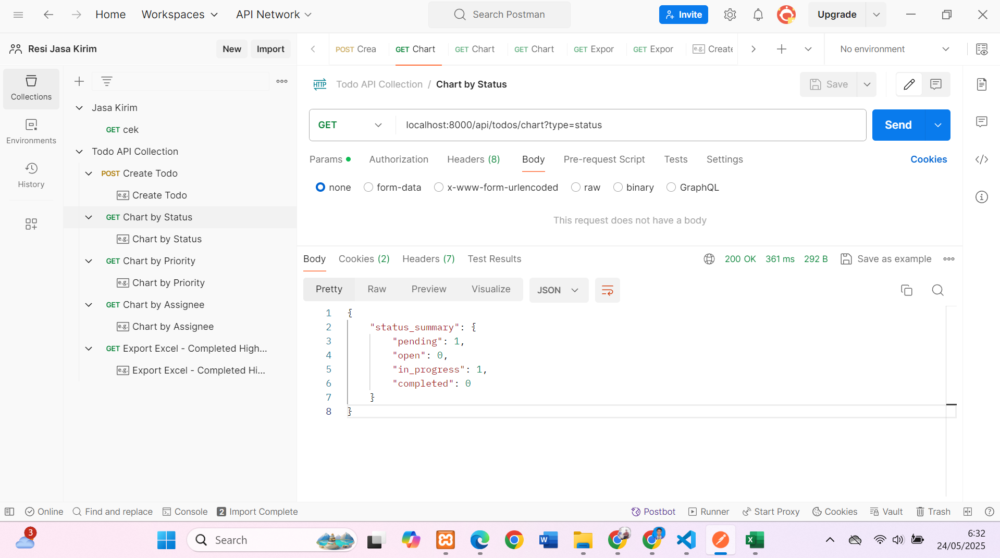
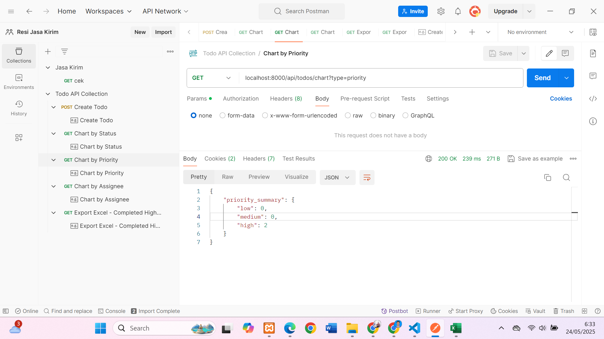
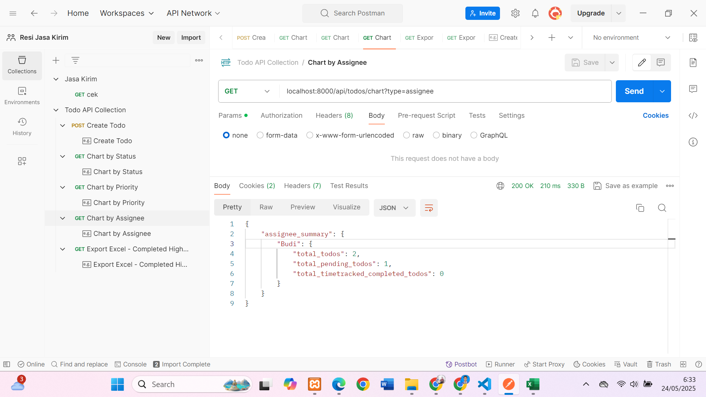
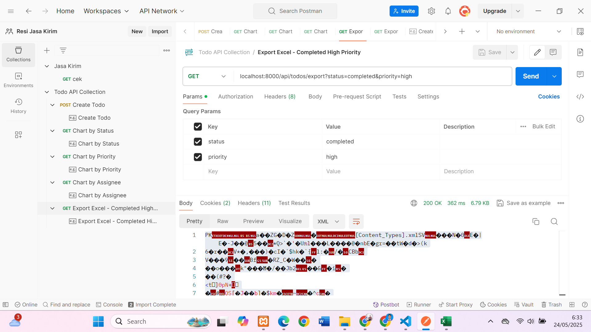

# ✅ Todo API - Rony Irfannandhy

## Dikerjakan menggunakan **Laravel 11**

## 🚀 Fitur Utama

### 1. ✅ Create Todo

-   **Endpoint**: `POST /api/todos`
-   **Fields**:
    -   `title` (string, required)
    -   `assignee` (string, optional)
    -   `due_date` (date, required, tidak boleh tanggal lampau)
    -   `time_tracked` (numeric, default 0)
    -   `status` (enum: `pending`, `open`, `in_progress`, `completed`, default: `pending`)
    -   `priority` (enum: `low`, `medium`, `high`)

---

### 2. 📥 Export Todo List ke Excel

-   **Endpoint**: `GET /api/todos/export`
-   **Filtering Support**:
    -   `title`, `assignee`, `due_date`, `time_tracked`, `status`, `priority`

---

### 3. 📊 Chart Summary

-   **Endpoint**: `GET /api/chart?type={status|priority|assignee}`

---

## 🧪 Testing & Dokumentasi

### 📂 Postman Collection

-   File: `TodoAPICollection.postman_collection.json`
-   Lokasi: root folder
-   Digunakan untuk: test `POST`, `GET`, dan `Export`

### 📸 Screenshots

#### ✅ Create Todo


#### 📊 Chart Status



#### 📊 Chart Priority



#### 📊 Chart Assignee



#### 📊 Export Excell



#### 📥 Export Excel


---

## ⚙️ Setup Project Laravel

```bash
git clone https://github.com/<username>/todo-api.git
cd todo-api
composer install
cp .env.example .env
php artisan key:generate
# Edit .env sesuai DB
php artisan migrate
php artisan serve
```
